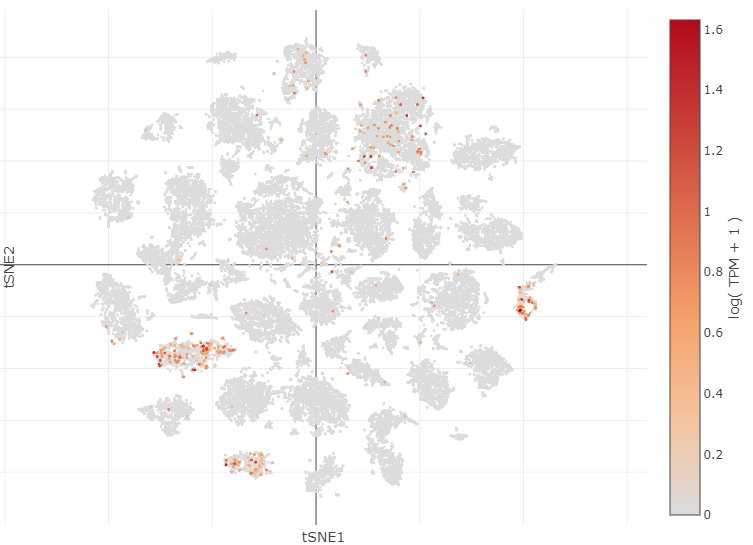

# Piezo Channel expressing Cell Types
Data from: [single cell portal](https://singlecell.broadinstitute.org/single_cell/study/SCP509/mouse-retinal-ganglion-cell-adult-atlas-and-optic-nerve-crush-time-series/?genes=Piezo2&cluster=Atlas%20RGCs&spatialGroups=--&annotation=Cluster--group--cluster&subsample=all&tab=scatter#study-visualize).

## Piezo 2 transcriptomic clusters: functional type
- 24_novel: **OODS T**
- 30_novel: **ON tr SmRF**
- 23_W3D2: ** **
- 34_novel: ** **
- 2_W3D1.2: **UHD**
- 19_novel: ** **

## Piezo 1 transcriptomic clusters: functional type

- 7_novel
- 22_M5
- 14_ooDS_Cck
