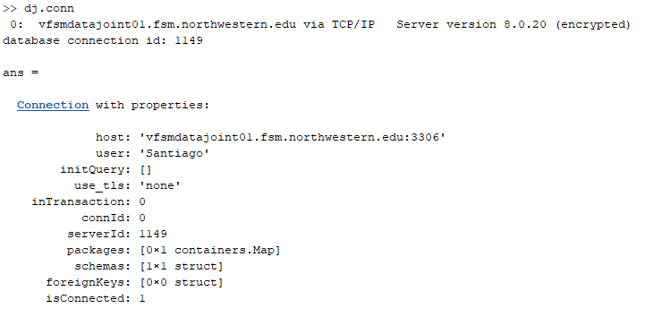

# 0. Setup startup file location
If it's not working. Run the startup file and make sure it's working and connected at DataJoint with `dj.conn` 

It should look like this: 

# Curation for each cell 
1. `DataGrouper`: launching the curator and looking the datasets. 
2. Setup startup file and its path
3. Curator mode 
4. Search by Filename
5. Add condition with attribute. *lookup what this really means*
6. Browser 
7. To Curator 
8. Filter
9. Save Dataset (turns green)

# Spike Detection
1. To spike detector 
    - Thresold or filetring 
2. Apply to all     
3. Go through to epochs. Select valid regions/delete invalid
4. 

# Non Curator mode
Is looking for datasets
Choose analysis: 
- Select Database and not command line 
- Replace all 
- Lookup plotter code 