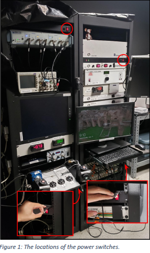
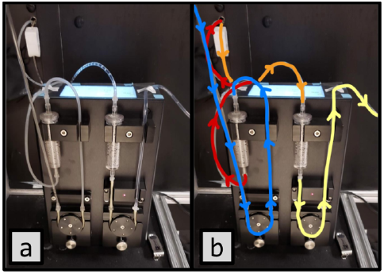
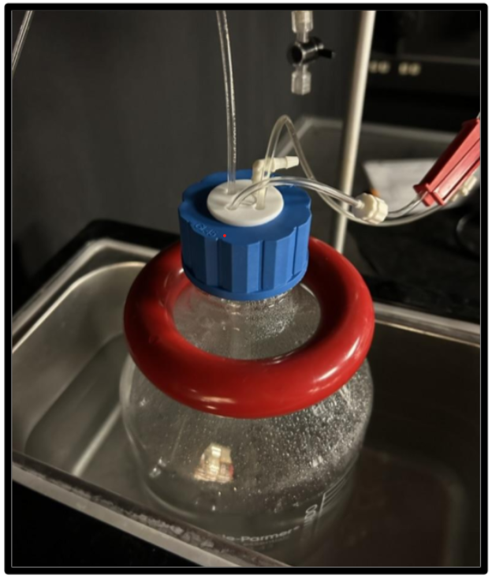

# Rig Set up
### The purpose of these instructions is to be a fast checklist to set up the rig before dissection. 

- Raph made a **fantastic and detailed** guide that can be found and downloaded [here](../images/RigSetUp.pdf)  for a more comprehensive explanation of each step.

## 0. Turn on the rig
Begin with turning on the four power strips. 
Turn on the monitors if they aren’t on automatically.

 

## 1. Perfusion
**Grab:** ames bottle, bubblers (x2) and their adaptors, tap with 4 holes, and dissection bottle. 
- Turn on bath heaters and fill them with tap water (2L)
- Turn on backup vaccum
- Insert and connect perfussion lines: 

     
- Ames 2L bottle:
    - Take out 250cc for dissection bottle.
    - Set up lines as shown in the figure (run the outflow into the bath for 2-3min)

     
- Running the perfussion:
    - Oppen PPS (perfussion software) ( the perfussion pump must be on for the software to recognize it)
    - **Before turning on the perfussion**. Check that the in and outflow lines are correctly placed in the dish and that backup vaccum is on. 
    - Turn on the perfussion
        - Let the outflow run in the bath for 2-3min and then put it back in the Ames bottle. 
    - Turn on dish heater

## 2. Microscope
- Open lin lab
- Turn on lamp
- Open multiclamp and symphony
- Focus at thebottom of the dish at 10x, then at 60x. 
    - Set Z at 0 
- Focus condenser
    - Turn the knob in the lower end of the scope until you see the condenser aperture. 
    - Switch from objective to condenser
    - Focus in **Z** and Set **C** at 0 
- Allignment cross: 

    Focused at the bottom of the dish!
    - In symphony, open the Allignment cross stimuli
    - Turn off lamp
    - Change filter (NDF) to 0 or 1, if needed
        
             *In rig B:* allignment cross is of around -40 to -50 uM in the condenser. If you focus it there, it is going to look sharper. 
## 3. Electrode 
- Chlorinate the electrode:
    - Unscrew the electrode holder
    - Sand off the old chloride from the tip of the wire. 
    - Place the red clamp onto the back of the electrode holder. 
    - Place the black clamp in the wire found in the sand paper recipient. 
    - Turn on the pulse generator. 
    - Dip the tip of both wires in the 3M sodium chloride solution for  about 15 seconds or until the wire tip is sufficiently black
    - Do not let the wires touch while in the solution.

- Base position: 
    - Set 10x objective at 7000 uM
    - Put the electrode in and find it.
    - Set electrode coordinates to 0
    - Swing out the electrode
    - Change the objective to 60x and go up to 7000 uM

            In rig A, the difference between the 10x and 60 objective is around 1200 uM (i.e 3000 uM in 60x will take you to 4200 in 10x), in rig B it is around 2000 uM 
   - Put the electrode in again and focus it. Set electrode coordinates to 0 again. 
    - Go to 3000 on Z and focus the electrode. Set that as **home in**. Turn into *approach mode* and go to positive in **Z**. Set  that position as **home out**. Make sure that the electrode can safely swing in and out. 

## 4. Multiclamp
- Reset default
- Standard configuration
- Check system noise: Should be less than **10**.

### **Caution:** Before dissecting, always check the perfussion. It's always the most common and fatal source of errors. 

